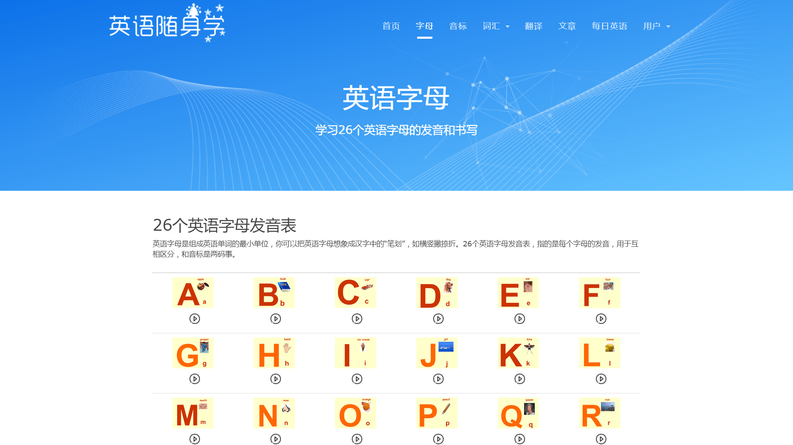
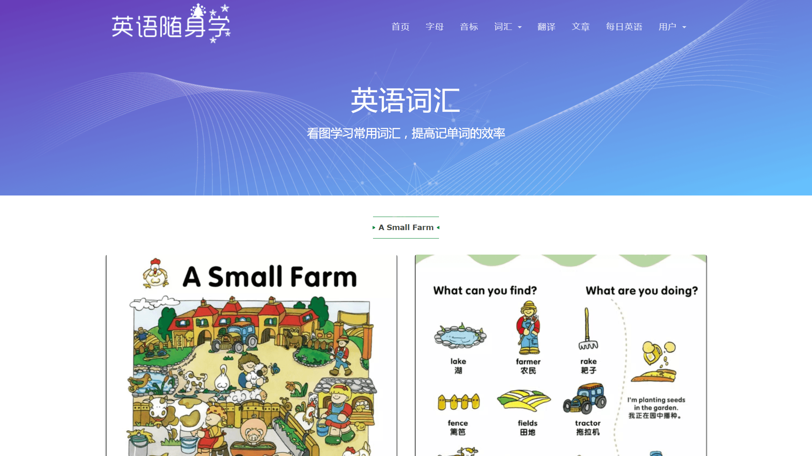
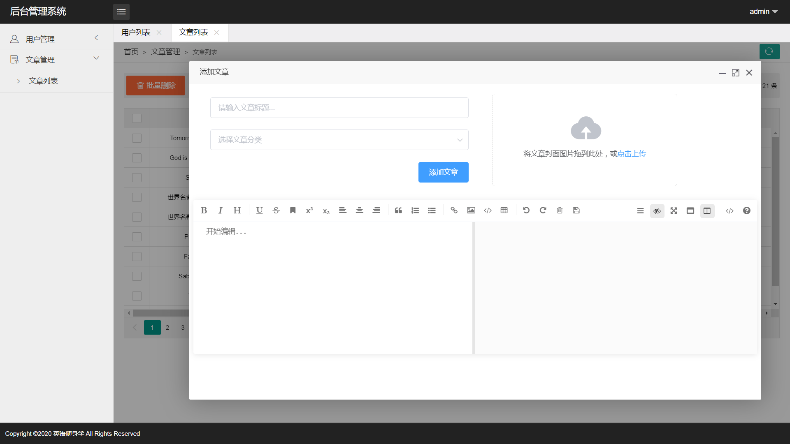

# 英语随身学

#### 介绍
本项目提供一种方便有效的方式来学习英语，提高英语学习兴趣，做到随时随地、循序渐进学习英语。主要功能包括字母 / 音标 / 词汇学习、文本翻译、单词本、英语文章浏览 / 共享、每日一句英语等。

#### 链接
英语随身学：[http://study.yongkj.cn/](http://study.yongkj.cn/)

#### 截图

#### 技术栈
MySQL+SpringBoot+Spring+SpringMVC+MyBatis+HTML+CSS+JS+JQuery+Bootstrap3+Layui+Vue+Element UI

1.  本项目同样采用前后端分离的开发方式，前端和后端通过json数据进行交互
2.  前端使用了 JQuery 框架 + Ajax 异步刷新来解析、渲染json数据，响应式布局主要采用 Bootstrap3 框架来完成
3.  项目使用 SpringBoot 来整合 SSM 框架（Spring + SpringMVC + MyBatis），提高后端开发效率
4.  使用 Jsoup 解析并获取网络上免费的英语学习资源
5.  采用 MD5 的方式对用户密码进行加密处理
6.  申请有道翻译 API 接口实现文本翻译功能
7.  利用“爱词霸每日一句”免费 API 接口完成每日一句英语功能
8.  使用基于 Vue 的开源 Markdown 编辑器 mavonEditor 实现文章的发布与查看功能
9.  后台的数据存储主要采用开源的Mariadb数据库来完成

#### 功能特性

1.  账号登录、注册功能，并且用户登录要输入验证码，用户登录之后三天内无需登录。
2.  英语字母的学习，提供26个英语字母发音表/手写展示图
3.  国际音标的学习，练习48个国际音标/标准BBC英语音标发音
4.  收录大量英语词汇，包括日常生活常用词汇、高中英语教材词汇以及大学英语四级词汇，满足日常学习需求
5.  翻译功能，可以查询陌生单词，翻译英语长难句子、段落，翻译中文文本为英文
6.  文章功能，可以浏览各类英语学习文章、英语学习视频
7.  每日一句英语，了解名人名言、经典谚语和人生格言
8.  单词本功能，可以添加、删除查询过的陌生英语单词，方便学习、记忆陌生词汇

#### 使用说明

1.  english_learning.sql 为数据库备份文件
2.  可在 src/main/resources/application.properties 配置文件中修改数据库连接信息
3.  一些 API 接口的 appKey 和 secretKey 暂未删除，因为本身也是免费的
4.  如需打包部署服务器，则可以使用 Eclipse 或者 IDEA 打包项目，默认打包为 Jar 包
